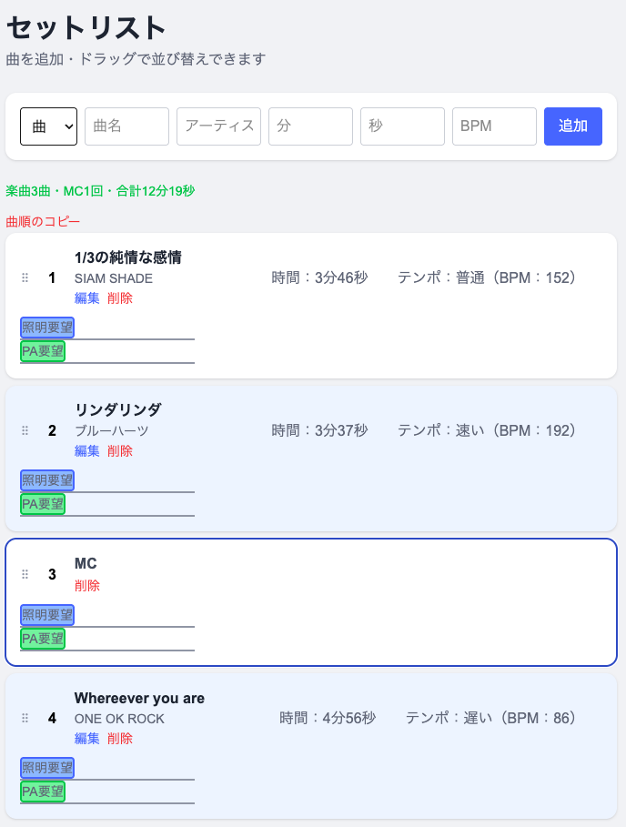

# セットリスト管理アプリ（setlist-app）

バンドのライブで使う「セットリスト（曲順）」を管理する Web アプリ。
曲の追加・編集・削除に加え、**ドラッグ&ドロップで曲順を入れ替え**できます。MC（トーク枠）も挿入可能。

🔗 **本番デモ**: https://setlist-app-r7qz.vercel.app/songs
💻 **ソース**: https://github.com/kento81642/setlist-app

---
## 📷 画面



ドラッグ&ドロップで曲順を並び替え、曲数・MC数・合計演奏時間は配列から算出して表示しています。

---
## 🛠 技術スタック

| 分類              | 技術                     |
| ----------------- | ------------------------ |
| フレームワーク    | Next.js 16（App Router） |
| UIライブラリ      | React                    |
| 言語              | TypeScript               |
| スタイリング      | Tailwind CSS             |
| DB / 認証         | Supabase                 |
| ドラッグ&ドロップ | @dnd-kit                 |
| デプロイ          | Vercel                   |

---

## ✨ 主な機能

- **CRUD**: 曲の追加・一覧・編集・削除
- **MC 機能**: 曲ではない「MC（トーク・休憩）」枠をプルダウンから挿入
- **入力バリデーション**: 曲名・アーティストの空欄を防止
- **項番・ゼブラ模様**: 見やすいセットリスト表示

---

## 💡 工夫した点

- **Server / Client Component の分離**: データ取得は Server Component で行い、操作（フォーム・並び替え・削除）が必要な部分だけを `"use client"` の小さな Client Component に切り出した。
- **動的描画（SSR）**: CRUD で常に最新データを表示するため、`connection()` でリクエストごとの動的描画に切り替えた。
- **楽観的更新**: ドラッグ並び替え時は、DB の応答を待たずに先に画面を更新し、操作感を高めた。
- **ドラッグ&ドロップ並び替え**: ユーザが曲順を直感的に入れ替えるよう`@dnd-kit`で並び替えを実装し`position` 列で順番を永続化した。
- **曲数・MC数を表示**: 新しいstateを増やさず、`items`を`filter`で計算して表示。計算で出せる値をstateで増やすと、追加・削除処理のたびに手動更新が必要になりバグの元となるため敢えて状態を保持させなかった。

---

## 📝 苦労した点・学んだこと

- `useState(props)` は初期値を一度しか参照しないため、削除後に一覧が更新されないバグに遭遇。`useEffect` で props と state を同期して解決した。
- 「ローカルでは動くのに本番で反映されない」問題は、開発モードが常に動的なのに対し本番は静的最適化されることが原因と理解し、`connection()` で解決した。

---

## 🚀 ローカルでの起動

```bash
npm install
npm run dev
```

`.env.local` に Supabase の環境変数を設定してください：

```
NEXT_PUBLIC_SUPABASE_URL=your-supabase-url
NEXT_PUBLIC_SUPABASE_KEY=your-supabase-anon-key
```
